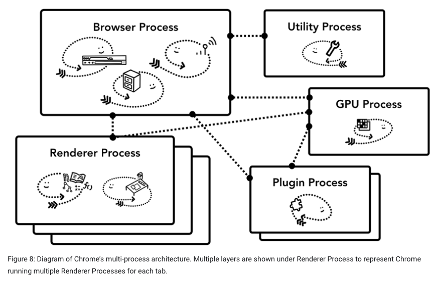
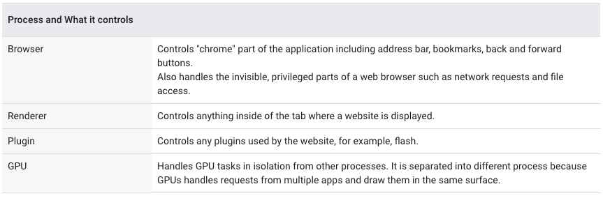
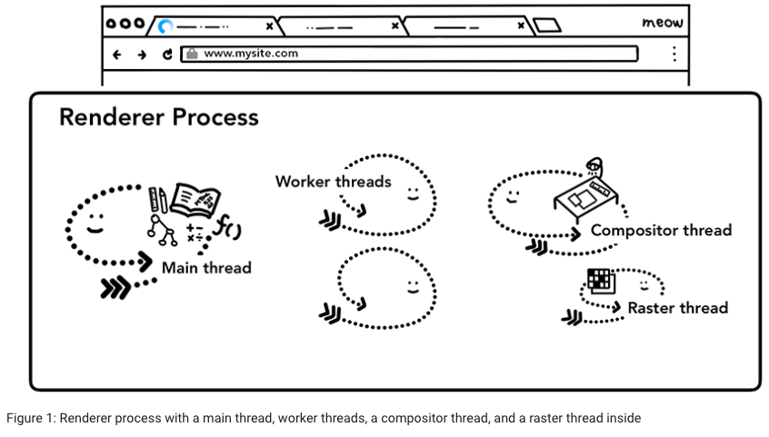

# 浏览器是怎么工作的

## 浏览器架构

浏览器架构实现没有标准规范， 可以是拥有许多不同线程的单进程， 也可以是多进程，每个进程拥有几个线程，进程间通过 IPC 通信。

下面以 Chrome 为例, 顶部的 Browser 进程协调负责应用不同部分的其他进程， 对于 Renderer 进程， 浏览器的每个 tab 分配一个进程（资源允许的话； 现在页面内有 iframe 的话，也可以给每个站点分配一个进程。）

### 多进程架构特点

* 一个 tab 无响应的话， 不影响其他 tab 功能
* 安全性和沙盒（sandboxing）
  * 操作系统提供了限制进程特性的功能，浏览器可以应用来限制部分特性， 比如 renderer process 的文件访问权限。
* 缺点： 内存占用更高
  * 解决方法： 服务化（详见参考文章 part 1）

## 导航

Browser Process 内
* UI thread  负责导航栏按钮和输入框
* Network thread  负责网络请求
* Storage thread  文件相关操作

### navigation 步骤

1. Handling input
  * UI thread 判断地址栏输入是搜索查询数据还是 URL
2. Start navigation
  * UI thread 发起一个获取站点内容的 network call，tab 上 loading spinner 显示， 然后 Network thread 为请求建立连接
  * Network thread 收到重定向的响应的话，就会通知 UI thread 服务请求重定向， 然后另一个 URL request 被发起
3. Read response
  * Network thread 收到响应后读取 content-type header 判断数据类型
  * 如果是 html 的话进入下一步， 是 zip 或其他文件的话就将数据传给 download manager
  * 安全检查也发生在这一步，是恶意站点的话显示 warning page
4. Find a renderer process
  * Network thread 通知 UI thread 数据准备好了， UI thread 查找一个 renderer process 去渲染网页
  * 因为网络请求可能耗时几百毫秒，可以做一个加快进程的优化，在第二步发起网路请求的时候 UI thread 就可以查找或开启一个 renderer process
5. Commit navigation
  * 数据和 renderer process 都准备好后， browser process 向 renderer process 发送一个 IPC 来提交跳转，同时把数据传过去。 browser process 收到 renderer process 确认后，导航至此结束，然后文档加载开始。
6. 额外步骤
  * renderer process "finishes" rendering 后，向 browser process 发回一个 IPC（ this is after all the onload events have fired on all frames in the page and have finished executing ），UI thread 结束 tab 上的 loading spinner。

#### 跳转到不同站点的情况
* 需要 check beforeunload 事件
* start new renderer process, unload old renderer process

## Renderer process 内部工作

renderer process 负责一个 tab 内的所有事情
* 其中 main thread 处理绝大部分的代码
* 使用 web worker 或 service worker 的话，部分代码由 worker threads 处理
* compositor and raster threads 帮助高效平滑的渲染页面

### Parsing
* main thread 解析 html, 构建 DOM
* subresource loading
  * 额外资源在解析过程中按顺序请求
  * preload scanner
    * 解析 html 的同时， "preload scanner" 并行处理， 遇到 `` 或 `<link>` 时， 向 browser process 内的 network thread 发出请求
* JS 会阻塞 parsing
  * 因为 JS 会使用像 document.write() 来改变 DOM 结构

#### 提示资源加载方式
* `<script>` 上 defer, async
* `<link>` 上 preload, prefetch

### Style calculation

* main thread 解析 CSS 确定每一个 DOM node 的 computed style

### Layout

* main thread 遍历 DOM 和 computed style，创建 layout tree
* layout tree 拥有每一个节点的几何信息， x、y坐标，边界盒尺寸等
* layout tree 和 DOM tree 相似但并不一样，display:none 的元素不在，添加了伪元素

### Paint

* main thread 遍历 layout tree 创建 **paint records**
* Paint record is a note of painting process like "background first, then text, then rectangle"

### Compositing

#### 概念
* rasterizing: Turning the structure of the document, the style of each element, the geometry of the page, and the paint order information into pixels on the screen
* Compositing: separate parts of a page into layers, rasterize them separately, and composite as a page in a separate thread called compositor thread

#### 步骤
* main thread walks through the layout tree to create the **layer tree**. 
* the main thread commits that information to the compositor thread. The compositor thread then rasterizes each layer, create **compositor frame**.
  * A layer could be large like the entire length of a page, so the compositor thread divides them into tiles and sends each tile off to raster threads. Raster threads rasterize each tile and store them in GPU memory.
  * Once tiles are rastered, compositor thread gathers tile information called draw quads to create a compositor frame.
* A compositor frame is then submitted to the browser process via IPC. At this point, another compositor frame could be added from UI thread for the browser UI change or from other renderer processes for extensions. **These compositor frames are sent to the GPU to display it on a screen.** If a scroll event comes in, compositor thread creates another compositor frame to be sent to the GPU.

## 参考文章
* [Inside look at modern web browser (part 1)](https://developers.google.com/web/updates/2018/09/inside-browser-part1)
* [Inside look at modern web browser (part 2)](https://developers.google.com/web/updates/2018/09/inside-browser-part2)
* [Inside look at modern web browser (part 3)](https://developers.google.com/web/updates/2018/09/inside-browser-part3)
* [Inside look at modern web browser (part 4)](https://developers.google.com/web/updates/2018/09/inside-browser-part4)