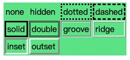

# 盒模型与外边距重叠

## 盒模型

### 不同类型盒子

block: 
* 盒子会在内联的方向上扩展并占据父容器在该方向上的所有可用空间，在绝大数情况下意味着盒子会和父容器一样宽
* 每个盒子都会换行
* width 和 height 属性可以发挥作用
* 内边距（padding）, 外边距（margin） 和 边框（border） 会将其他元素从当前盒子周围“推开”

inline:
* 盒子不会产生换行
* width 和 height 属性将不起作用
* 垂直方向的内边距、外边距以及边框会被应用但是不会把其他处于 inline 状态的盒子推开
* 水平方向的内边距、外边距以及边框会被应用而且也会把其他处于 inline 状态的盒子推开

inline-block:
* 设置width 和height 属性会生效
* padding, margin, 以及border 会推开其他元素

### 盒模型各个部分

content、 padding、 border、 margin

标准盒模型 width、height 设置的是 content-box。 可以通过 box-sizing 修改。

```css
* {
  box-sizing: border-box;
}
```

#### margin

margin, margin-top/bottom/left/right

* `[ <length> | <percentage> | auto ]{1,4}` 可以为负值表示收缩， 百分比是相对于包含块的。
* 外边距折叠： 父子或相邻 block 元素外边距在垂直方向重叠。

#### border

border, border-top, border-width, border-style, border-color, border-top-width

border-style 取值如下：



#### padding

padding, padding-left

* padding 不能为负值


## 外边距重叠

块的上外边距(margin-top)和下外边距(margin-bottom)有时合并(折叠)为单个边距，其大小为单个边距的最大值(或如果它们相等，则仅为其中一个)，这种行为称为边距重叠。

只有在同一 BFC 中的两个盒子垂直外边距相邻时会发生重叠。
