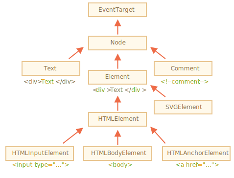

# DOM

Document Object Model（文档对象模型）是用来呈现以及与任意 HTML 或 XML文档交互的API。

在DOM编程时，通常使用的最多的就是 Document 和 window 对象。简单的说， window 对象表示浏览器中的内容，而 document 对象是文档本身的根节点。Element 继承了通用的 Node 接口, 将这两个接口结合后就提供了许多方法和属性可以供单个元素使用。在处理这些元素所对应的不同类型的数据时，这些元素可能会有专用的接口，如 table 对象实现了 HTML Table Element Interface。

下面列出一些最常用的 api。

## 常用 dom api

Node 继承了 EventTarget； Document、Element、Attr、CharacterData (which Text, Comment, and CDATASection inherit) 等继承了 Node。



### EventTarget

EventTarget 是一个由可以接收事件的对象实现的接口，并且可以为它们创建侦听器。

#### 方法
* addEventListener(type, listener, useCapture/options)
* removeEventListener(type, listener, useCapture/options)
* dispatchEvent(event)


### Node

#### 属性
* nodeName
  * 只读， HTMLElement的名字跟它所关联的标签对应, Text节点对应的是 '#text', 还有Document节点对应的是 '#document'
* nodeType
  * 只读， 1 元素， 2 属性， 3 文本， 8 注释， 9 文档， 11 fragment
* nodeValue
  * 返回或设置当前节点的值， 元素节点为 null, 文本节点就是文本值
* parentNode   *只读， 返回父节点或null*
* parentElement   *只读，返回一个当前节点的父节点 Element 。 如果当前节点没有父节点或者说父节点不是一个元素(Element), 这个属性返回null*
* previousSibling   *只读，返回一个当前节点同级的前一个结点或null*
* nextSibling   *只读，返回与该节点同级的下一个节点 Node，如果没有返回null*
* childNodes   *只读，返回一个包含了该节点所有子节点的实时的NodeList*
* firstChild   *只读，返回该节点的第一个子节点Node或null*
* lastChild    *只读，返回该节点的最后一个子节点Node或null*
* textContent    *返回或设置一个元素内所有子结点及其后代的文本内容*

#### 方法
* appendChild(childNode)
  * 将指定的 childNode 参数作为最后一个子节点添加到当前节点。
  * 如果参数引用了 DOM 树上的现有节点，则节点将从当前位置分离，并附加到新位置。
* cloneNode(deep)
  * 克隆一个 Node，并且可以选择是否克隆这个节点下的所有内容
* contains(node)
  * 包含，包括是本身时，返回 true
* getRootNode()  *正常文档中为 document*
* hasChildNodes() 
  * 等价于 node.firstChild !== null 或 node.childNodes.length > 0
* parentNode.insertBefore(newNode, referenceNode)
* parentNode.removeChild(childNode)
* parentNode.replaceChild(newChild, oldChild)


```js
// 移除所有子节点
function removeAllChildren(node) {
  while(node.firstChild) {
    node.removeChild(node.firstChild);
  }

  // or
  node.textContent = '';
}

// 遍历节点树
function eachNodeTree(node, callback) {
  if (node) {
    callback(node);
    Array.prototype.forEach.call(node.childNodes, (childNode) => {
      eachNodeTree(childNode, callback);
    });
  }
}
```

#### NodeList

NodeList 对象是一个节点的集合，是由 Node.childNodes 和 document.querySelectorAll 返回的.

在一些情况下，NodeList 对象是一个实时集合，也就是说，如果文档中的节点树发生变化，则已经存在的实时 NodeList 对象也会随之变化。例如，Node.childNodes 是实时的

* 属性和方法
  * length
  * item(index)
* 遍历
  * for 循环
  * Array.prototype.forEach.call(nodeList, node => {...})


### Element

#### 属性
* tagName  *只读*
* attributes  *只读*
* dataset *以 data- 开头的特性*
* id
* className
* classList  *只读*
  * value
  * item(index)
  * add(str1, ...)
  * remove(str1, ..)
  * toggle(str)
  * contains(str)
  * replace(oldClass, newClass)
* clientWidth / clientHeight  *只读，截止内边距，四舍五入到整数，内联及没有 CSS 样式的元素为 0*
* scrollWidth / scrollHeight  *只读*
* scrollLeft / scrollTop 
* innerHTML
* outHTML

#### 方法
* getElementsByClassName(name)  *返回一个即时更新的（live） HTMLCollection*
* getElementsByTagName(tagName)  *返回一个动态的包含所有指定标签名的元素的HTML集合HTMLCollection*
* querySelector(selector)
* querySelectorAll(selector)  **返回一个non-live的NodeList**
* matches(selector)  *返回 true/false*
* closest(selector) *查找与 CSS 选择器匹配的最近的祖先*
* getAttribute(attrName)
* hasAttribute(attrName)
* setAttribute(attrName, value)
* removeAttribute(attrName)
* toggleAttribute(attrName, force)
* getAttributeNames()
* getBoundingClientRect()
  * {top, bottom, left, right, width, height, x, y}
  * [解释](https://developer.mozilla.org/zh-CN/docs/Mozilla/Tech/XPCOM/Reference/Interface/nsIDOMClientRect)
* scrollIntoView()
  * 有兼容性， [解释](https://developer.mozilla.org/zh-CN/docs/Web/API/Element/scrollIntoView)


### Document

* getElementById(id)
* getElementsByClassName(name)
* getElementsByTagName(tagName)
* querySelector(selector)
* querySelectorAll(selector)
* createTextNode(data)
* createElement(tagName[, options])
* createDocumentFragment()
* createComment(data)
* ...


## 参考文档
* [DOM概述](https://developer.mozilla.org/zh-CN/docs/Web/API/Document_Object_Model/Introduction)