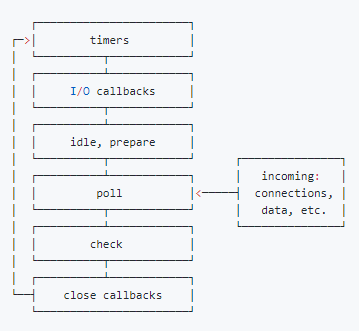

# JS 是怎么工作的

## The JS Engine

最常见的 JS 引擎是 Chrome 和 Node.js 使用的 Google's V8 Engine。引擎一般由两部分组成：
* Memory Heap(内存堆) -- 负责内存分配
* Call Stack(调用栈) -- 代码执行时分配 stack frames(栈帧)


## The Runtime (运行时)

以浏览器为例，除了 JS 引擎， 还提供 Web APIs， Event Loop， Callback Quene 等。


## The Call Stack

JS 是单线程的，只有一个调用栈，一次只能做一件事情。

调用栈是记录程序执行位置的数据结构，开始执行一个函数时，往栈里推入一个栈帧，函数执行结束时，弹出顶部的栈帧。

```js
function multiply(x, y) {
  return x * y;
}
function printSquare(x) {
  var s = multiply(x, x);
  console.log(s);
}
printSquare(5);
```


调用栈有最大栈帧数（maximum Call Stack size）限制，超过了就抛出爆栈错误。比如递归没加退出条件。


## The Event Loop

### 概念
* event loop
  * 为了协调事件，用户交互，脚本，渲染，网络等，用户代理必须使用 event loop
* task
  * 一个event loop有一个或者多个task队列
  * 当用户代理安排一个任务，必须将该任务增加到相应的event loop的一个tsak队列中
  * 每一个task都来源于指定的任务源，比如可以为鼠标、键盘事件提供一个task队列，其他事件又是一个单独的队列。可以为鼠标、键盘事件分配更多的时间，保证交互的流畅。
  * task 任务源
    * script 整体代码
    * setTimeout, setInterval, setImmediate
    * I/O
    * UI rendering
* microtask
  * 每一个 event loop 都有一个 microtask 队列，一个 microtask 会被排进 microtask 队列而不是 task 队列。
  * microtask 任务源
    * process.nextTick
    * Promise
    * Object.observe
    * MutationObserver
  * 注：Promise 规范里提及 then 方法可以采用宏任务，也可以采用微任务来实现。普遍共识是用微任务。

### event loop 处理过程（Processing model）

> 一个event loop只要存在，就会不断执行下边的步骤：
> 1. 在tasks队列中选择最老的一个task,用户代理可以选择任何task队列，如果没有可选的任务，则跳到下边的microtasks步骤。
> 2. 将上边选择的task设置为正在运行的task。
> 3. Run: 运行被选择的task。
> 4. 将event loop的currently running task变为null。
> 5. 从task队列里移除前边运行的task。
> 6. Microtasks: 执行microtasks任务检查点。（也就是执行microtasks队列里的任务）
> 7. 更新渲染（Update the rendering）...
> 8. 如果这是一个worker event loop，但是没有任务在task队列中，并且WorkerGlobalScope对象的closing标识为true，则销毁event loop，中止这些步骤，然后进行定义在Web workers章节的run a worker。
> 9. 返回到第一步。

event loop 不断循环上面的步骤， 其中第七步更新渲染是可能有的。

关于渲染更新：

* 在一轮event loop中多次修改同一dom，只有最后一次会进行绘制。
* 渲染更新（Update the rendering）会在event loop中的tasks和microtasks完成后进行，但并不是每轮event loop都会更新渲染，这取决于是否修改了dom和浏览器觉得是否有必要在此时立即将新状态呈现给用户。如果在一帧的时间内（时间并不确定，因为浏览器每秒的帧数总在波动，16.7ms只是估算并不准确）修改了多处dom，浏览器可能将变动积攒起来，只进行一次绘制，这是合理的。
* 如果希望在每轮event loop都即时呈现变动，可以使用requestAnimationFrame。

### Node.js 中的 Event Loop

Node.js 里的 Event Loop 和浏览器里的是完全不同的东西， 由 libuv 驱动。



libuv 引擎中的事件循环分为 6 个阶段， 会按照顺序反复运行。外部输入数据–>轮询阶段(poll)–>检查阶段(check)–>关闭事件回调阶段(close callback)–>定时器检测阶段(timer)–>I/O 事件回调阶段(I/O callbacks)–>闲置阶段(idle, prepare)–>轮询阶段（按照该顺序反复运行）…


* timers 阶段：这个阶段执行 timer（setTimeout、setInterval）的回调
* I/O callbacks 阶段：处理一些上一轮循环中的少数未执行的 I/O 回调
* idle, prepare 阶段：仅 node 内部使用
* poll 阶段：获取新的 I/O 事件, 适当的条件下 node 将阻塞在这里
* check 阶段：执行 setImmediate() 的回调
* close callbacks 阶段：执行 socket 的 close 事件回调

#### poll

poll 是一个至关重要的阶段，这一阶段中，系统会做两件事情

* 回到 timer 阶段执行回调
* 执行 I/O 回调

并且在进入该阶段时如果没有设定了 timer 的话，会发生以下两件事情

* 如果 poll 队列不为空，会遍历回调队列并同步执行，直到队列为空或者达到系统限制
* 如果 poll 队列为空时，会有两件事发生
  * 如果有 setImmediate 回调需要执行，poll 阶段会停止并且进入到 check 阶段执行回调
  * 如果没有 setImmediate 回调需要执行，会等待回调被加入到队列中并立即执行回调，这里同样会有个超时时间设置防止一直等待下去

当然设定了 timer 的话且 poll 队列为空，则会判断是否有 timer 超时，如果有的话会回到 timer 阶段执行回调。

#### 注意点

* setTimeout 和 setImmediate
  * 对于以下代码来说，setTimeout 可能执行在前，也可能执行在后。
  * 首先 setTimeout(fn, 0) === setTimeout(fn, 1)，这是由源码决定的
    * 进入事件循环也是需要成本的，如果在准备时候花费了大于 1ms 的时间，那么在 timer 阶段就会直接执行 setTimeout 回调
  * 如果准备时间花费小于 1ms，那么就是 setImmediate 回调先执行了

```js
setTimeout(function timeout () {
  console.log('timeout');
},0);
setImmediate(function immediate () {
  console.log('immediate');
});
```

但当二者在异步 i/o callback 内部调用时，总是先执行 setImmediate，再执行 setTimeout

* precess.nextTick
  * 这个函数其实是独立于 Event Loop 之外的，它有一个自己的队列，当每个阶段完成后，如果存在 nextTick 队列，就会清空队列中的所有回调函数，并且优先于其他 microtask 执行。

```js

setTimeout(() => {
  console.log('timer1')
}, 0)
Promise.resolve().then(function() {
  console.log('promise1')
})
process.nextTick(() => {
 console.log('nextTick')
 process.nextTick(() => {
   console.log('nextTick')
   process.nextTick(() => {
     console.log('nextTick')
     process.nextTick(() => {
       console.log('nextTick')
     })
   })
 })
})
// nextTick=>nextTick=>nextTick=>nextTick=>promise1=>timer1
```

### 浏览器和 Node.js 中 Event Loop 对比

浏览器环境下，microtasks 的任务队列是在每个 macrotask 执行完之后执行。而在 Node.js 中，microtasks 会在事件循环的各个阶段之间执行，也就是一个阶段执行完毕，就会去执行 microtasks 队列的任务。


```js
setTimeout(()=>{
    console.log('timer1')
    Promise.resolve().then(function() {
        console.log('promise1')
    })
}, 0)
setTimeout(()=>{
    console.log('timer2')
    Promise.resolve().then(function() {
        console.log('promise2')
    })
}, 0)

// 浏览器端运行结果：timer1=>promise1=>timer2=>promise2
// Node 端运行结果：timer1=>timer2=>promise1=>promise2
```


## 内存管理

C 语言有 `malloc()` 和 `free()` 来分配和回收内存。

内存生命周期： `allocate memory` --> `use memory` --> `release memory`

### 内存分配

* 静态分配
  * 内存分配在栈空间（stack space），分配固定的大小
  * 函数调用函数时，每个函数获取对应的一块栈空间，用来保存本地变量
  * 函数调用结束，按 LIFO(last-in-first-out) 顺序释放

```c
int n; // 4 bytes
int x[4]; // array of 4 elements, each 4 bytes
double m; // 8 bytes
```

* 动态分配：内存分配在堆空间（heap space）


### 垃圾回收

* 引用计数（Reference-counting garbage collection）
  * 一个对象被引用次数为 0 时，被认为是可回收的
  * 没法解决循环引用的问题

```js
var o1 = {
  o2: {
    x: 1
  }
};
// 2 objects are created. 
// 'o2' is referenced by 'o1' object as one of its properties.
// None can be garbage-collected

var o3 = o1; // the 'o3' variable is the second thing that 
            // has a reference to the object pointed by 'o1'. 
                                                       
o1 = 1;      // now, the object that was originally in 'o1' has a         
            // single reference, embodied by the 'o3' variable

var o4 = o3.o2; // reference to 'o2' property of the object.
                // This object has now 2 references: one as
                // a property. 
                // The other as the 'o4' variable

o3 = '374'; // The object that was originally in 'o1' has now zero
            // references to it. 
            // It can be garbage-collected.
            // However, what was its 'o2' property is still
            // referenced by the 'o4' variable, so it cannot be
            // freed.

o4 = null; // what was the 'o2' property of the object originally in
           // 'o1' has zero references to it. 
           // It can be garbage collected.
```

循环引用：

```js
function f() {
  var o1 = {};
  var o2 = {};
  o1.p = o2; // o1 references o2
  o2.p = o1; // o2 references o1. This creates a cycle.
}
f();
```

* 标记清除（Mark-and-sweep algorithm）

步骤：
1. Roots: In general, roots are global variables which get referenced in the code. In JavaScript for example, a global variable that can act as a root is the “window” object. The identical object in Node.js is called “global”. A complete list of all roots gets built by the garbage collector.
2. The algorithm then inspects all roots and their children and marks them as active (meaning, they are not garbage). Anything that a root cannot reach will be marked as garbage.
3. Finally, the garbage collector frees all memory pieces that are not marked as active and returns that memory to the OS.


### JS 中常见的内存泄漏

* Global variables
* Timers or Callbacks that are forgotten
* Closures
* Out of DOM references


## 参考文章
* [How JavaScript works: an overview of the engine, the runtime, and the call stack](https://blog.sessionstack.com/how-does-javascript-actually-work-part-1-b0bacc073cf)
* [从event loop规范探究javaScript异步及浏览器更新渲染时机](https://github.com/aooy/blog/issues/5)
* [浏览器与Node的事件循环(Event Loop)有何区别](https://blog.fundebug.com/2019/01/15/diffrences-of-browser-and-node-in-event-loop/)
* [How JavaScript works: memory management + how to handle 4 common memory leaks](https://blog.sessionstack.com/how-javascript-works-memory-management-how-to-handle-4-common-memory-leaks-3f28b94cfbec)
