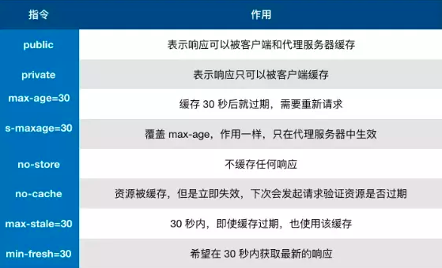
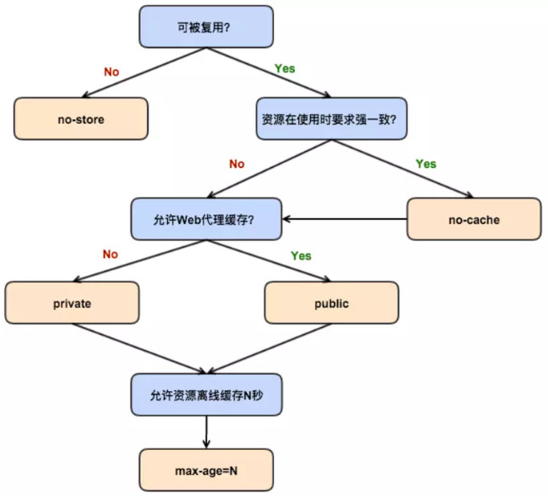
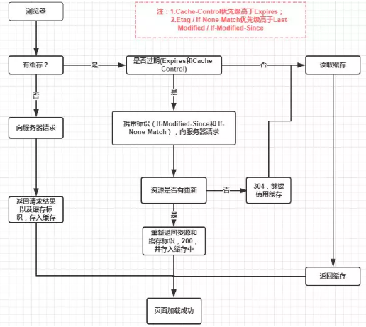
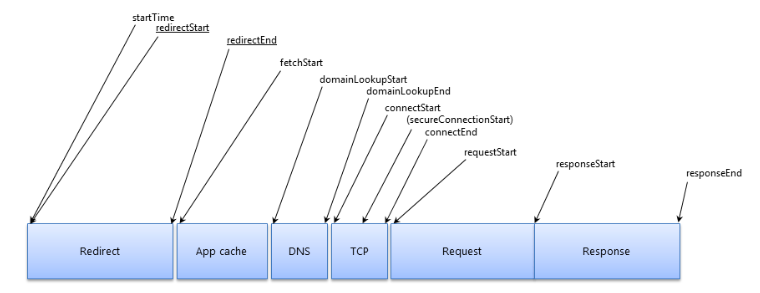
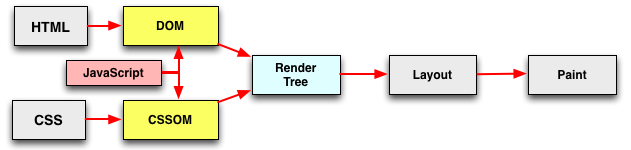
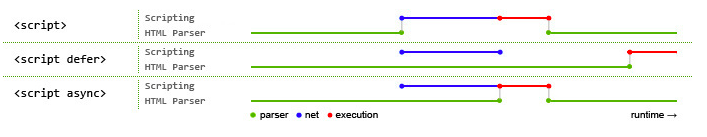

# 前端性能优化

## 缓存

  * 本地数据缓存
    * 单页应用内存数据缓存
    * cookie, localStorage / sessionStorage, indexedDB
  * Service Worker
    * 独立线程， 请求拦截
    * 可以让我们自由控制缓存哪些文件、如何匹配缓存、如何读取缓存，并且缓存是持续性的
  * Memory Cache
    * Network Size 显示 from memory cache
    * 高效，持续时间短， 关闭 tab 页之后缓存失效
  * Disk Cache
    * Network Size 显示 from disk cache
    * 缓存到硬盘，容量大
  * Push Cache
    * HTTP/2 推送的资源
  * 缓存 HTTP Header 设置
    * 强缓存相关的有 Expires 和 Cache-Control, NetWork 中可以看到 200（from memory cache 或 from disk cache）
    * Expires
      * `expires: Wed, 02 Oct 2019 06:16:30 GMT`
      * 指定资源到期时间， 是 HTTP/1 的产物
    * Cache-Control
      * HTTP/1.1 的产物， 与 Expires 同时存在时优先级高于 Expires
      * 例: `cache-control: max-age=600`, 单位为秒
      * 详细取值

        

        

    * 协商缓存是强制缓存失效后，浏览器携带缓存标识向服务器发起请求，由服务器根据缓存标识决定是否使用缓存的过程
      * 协商缓存生效，返回304，Not Modified
      * 协商缓存失效，返回200和请求结果
      * 通过 Last-Modified / If-Modified-Since 或 ETag / If-None-Match 设置
    * Last-Modified / If-Modified-Since
      * response header: `last-modified: Mon, 30 Sep 2019 16:46:39 GMT`
      * request header: `if-modified-since: Mon, 30 Sep 2019 16:46:39 GMT`
      * 浏览器下一次请求这个资源，浏览器检测到有 Last-Modified这个header，于是添加If-Modified-Since这个header，值就是Last-Modified中的值；服务器再次收到这个资源请求，会根据 If-Modified-Since 中的值与服务器中这个资源的最后修改时间对比，如果没有变化，返回304和空的响应体，直接从缓存读取，如果If-Modified-Since的时间小于服务器中这个资源的最后修改时间，说明文件有更新，于是返回新的资源文件和200
      * 弊端
        * 如果本地打开缓存文件，即使没有对文件进行修改，但还是会造成 Last-Modified 被修改，服务端不能命中缓存导致发送相同的资源
        * 因为 Last-Modified 只能以秒计时，如果在不可感知的时间内修改完成文件，那么服务端会认为资源还是命中了，不会返回正确的资源
    * ETag / If-None-Match
      * response header: `etag: W/"5d92316f-1a7d1"`
      * request header: `if-none-match: W/"5d92316f-1a7d1"`
      * Etag是服务器响应请求时，返回当前资源文件的一个唯一标识(由服务器生成)，只要资源有变化，Etag就会重新生成。
    * Last-Modified 与 ETag 对比
      * 在精确度上，Etag要优于Last-Modified。 Last-Modified的时间单位是秒，如果某个文件在1秒内改变了多次，那么他们的Last-Modified其实并没有体现出来修改，但是Etag每次都会改变确保了精度；如果是负载均衡的服务器，各个服务器生成的Last-Modified也有可能不一致。
      * 在性能上，Etag要逊于Last-Modified，毕竟Last-Modified只需要记录时间，而Etag需要服务器通过算法来计算出一个hash值。
      * 在优先级上，服务器校验优先考虑Etag。
  * http 缓存流程

    

## 发送请求

* 避免多余重定向
* DNS 预解析
  * `<link rel="dns-prefetch" href="//yourwebsite.com">`
* 预先建立连接
  * `<link rel="preconnect" href="//sample.com">`
* 使用 CDN



##  服务端响应

* 使用流进行响应
  * 现代浏览器都支持根据流的返回形式来逐步进行页面内容的解析、处理。这就意味着，即使请求的响应没有完全结束，浏览器也可以从手里已有的响应结果中进行页面的解析与渲染。
* 业务聚合（BFF 层）
* ...

## 页面解析与处理

* 资源在页面文档中的位置
  * JS 可以修改 DOM, 也可以修改 CSS。 根据标准规范，在 JavaScript 中可以访问 DOM。因此当遇到 JavaScript 后会阻塞 DOM 的解析。于此同时，为避免 CSS 与 JavaScript 之间的竞态，CSSOM 的构建会阻塞 JavaScript 的脚本执行。
  * 在最佳实践中，推荐把 CSS 样式表放在 `<head>` 之中（即页面的头部），把 JavaScript 脚本放在 `<body>` 的最后（即页面的尾部）。

  

* 使用 defer 和 async
  * defer 会在 HTML 解析完成后，按照脚本出现的次序再顺序执行；而 async 则是下载完成就立即开始执行，同时阻塞页面解析，不保证脚本间的执行顺序。
  * ubt 脚本一般用 async

  

* 页面文档压缩（gzip）

## 页面静态资源

* 减少不必要的请求
  * 浏览器对同源请求有并发上限的限制（例如 Chrome 是6）（HTTP/1.1）
  * TCP/IP 的拥塞控制也使其传输有慢启动（slow start）的特点，连接刚建立时包体传输速率较低，后续会渐渐提速
* 减少包体大小
* 降低应用资源时的消耗
  * CPU 密集计算
  * 频繁 DOM 操作
* 利用缓存

### JavaScript

* 减少不必要的请求
  * 代码拆分（code split）和按需加载
    * 思路
    
    ```js
    document.getElementById('btn').addEventListener('click', e => {
      const script = document.createElement('script');
      script.src = '/static/js/toload.js';
      document.getElementsByTagName('head')[0].appendChild(script);
    });
    ```

    * webpack 内 dynamic import
    * AMD(RequireJS)

  * 代码合并
* 减少包体大小
  * 代码压缩
    * UglifyJS
    * gizp
  * Tree Shaking
  * 优化 polyfill 使用
    * 根据浏览器支持情况来下发 polyfill
  * webpack
    * webpack-bundle-analyzer 分析各个模块占用大小

## 运行时

* 注意强制同步布局
  * 避免修改了 dom 再获取 dom 其他属性
* 善用 Composite
* 长列表优化
  * 虚拟列表实现
* 滚动事件优化
  * throttle
  * debounce
* 避免 JS 运行事件过长

## 预加载

* 预加载技术
  * Resource Hints
    * DNS Prefetch
    * Preconnect
    * Prefetch
      * `<link rel="prefetch" href="/prefetch.js" as="script">`
    * Prerender
      * `<link rel="prerender" href="//sample.com/nextpage.html">`
    * Preload
      * `<link rel="preload" href="./nextpage.js" as="script">`

    与 Prefetch 相比，Preload 会强制浏览器立即获取资源，并且该请求具有较高的优先级（mandatory and high-priority），因此建议对一些当前页面会马上用到资源使用 Preload；相对的，Prefetch 的资源获取则是可选与较低优先级的，其是否获取完全取决于浏览器的决定，适用于预获取将来可能会用到的资源。

    * 在 webpack 中使用

    ```js
    // prefetch
    import(/* webpackPrefetch: true */ './sub1.js');

    // preload
    import(/* webpackPreload: true */ './sub2.js')
    ```

  * 基于 JavaScript 的预加载
    * 图片(不需要插入页面)

    ```js
    let img = new Image();
    img.src = '/static/img/prefetch.jpg';
    ```

    * JS、CSS(需要通过 script、link 添加到页面)

## 参考文章

* [https://developer.mozilla.org/zh-CN/docs/Web/Performance](https://developer.mozilla.org/zh-CN/docs/Web/Performance)
* [前端性能优化](https://alienzhou.github.io/fe-performance-journey/)
* [深入理解浏览器的缓存机制](https://www.jianshu.com/p/54cc04190252)